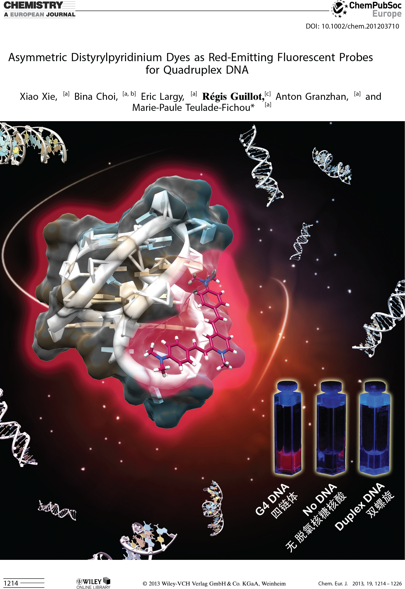

# Portfolio

## Covers

### Chemical Reviews

 
<a href="https://pubs.acs.org/toc/chreay/119/10">Link to the issue</a>

### Chemistry - A European Journal

#### Inside cover

 
<a href="https://chemistry-europe.onlinelibrary.wiley.com/doi/10.1002/chem.201490019">Link to the publication</a>

#### Frontispiece

 
<a href="https://chemistry-europe.onlinelibrary.wiley.com/doi/full/10.1002/chem.201203710">Link to the publication</a>

### IECB board report

 

## Logos

### ARNA lab logo

### ARNA lab logo color schemes

